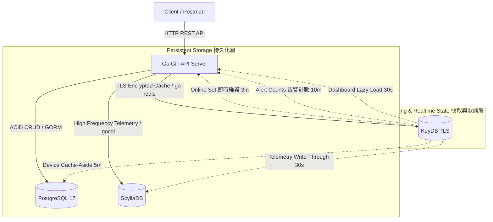

# 🏛️ 統一設備管理平台 (UDM) 系統架構深探與技術取捨報告

> **報告目的**：為準備向系統架構師（System Architect）進行專題簡報，本報告系統化地整理了 UDM 平台的所有設計決策、技術選型、高頻時序處理、分散式一致性、高可用降級策略，以及多執行緒與並發安全等實作細節。
>
> **適用閱讀者**：剛轉職的新人工程師（幫助您在面對架構師的深度追問時，能以 Solution Architect 的高度進行答辯）。

---

## 🗺️ 1. 整體系統架構與多維度資料流

UDM 平台採取了 **多資料庫異構架構** (Polyglot Persistence)，確保每一種資料都存放在最合適其讀寫特性的儲存引擎中。

### 1.1 系統架構圖 (Mermaid)


---

## ⚖️ 2. 關鍵技術選型與對照比較 (Trade-offs)

架構師最關心的是 **「Why (為什麼)」**。您必須清楚說出每項選型背後的取捨邏輯。

### 2.1 儲存時序數據：為什麼選 ScyllaDB，而不是 PostgreSQL (TimescaleDB) 或 InfluxDB？

| 比較維度 | ScyllaDB (本專案選擇) | PostgreSQL + TimescaleDB | InfluxDB |
| :--- | :--- | :--- | :--- |
| **架構類型** | 分散式、無主節點 (Peer-to-Peer) | 單機關聯式 + 時序分區插件 | 專用時序資料庫 |
| **寫入吞吐量** | **極高** (LSM-Tree 結構，線性擴展) | 中等 (受限於單機 B-Tree 與行鎖) | 高 |
| **高可用性** | **極佳** (多 Replica，無單點故障) | 較差 (依賴 Primary-Replica 切換) | 社群版不支援叢集高可用 |
| **複雜查詢/JOIN** | ❌ 不支援 (需由應用層處理) |  支援完整 SQL 與 JOIN | ❌ 不支援 (需使用 Flux/InfluxQL) |
| **硬體資源開銷** | 較高 (至少需要 3 節點起步) | 低 | 低 |

* 💡 **架構師追問**：*「PostgreSQL 已經是 Source of Truth，加裝 TimescaleDB 插件也能存時序，為何還要引進 ScyllaDB？」*
  * **答辯要點**：
    1. **I/O 資源隔離**：IoT 設備回報是極高頻的寫入場景（例如 1000 台設備每 5 秒回報一次，一天就是 1728 萬筆寫入）。若與使用者 CRUD 共用 PostgreSQL，高頻寫入會產生龐大的 WAL 日誌與磁碟 I/O 競爭，導致核心事務被拖垮。
    2. **無單點故障與寫入吞吐**：ScyllaDB 使用 C++ 重寫了 Cassandra，具備極高的 LSM-Tree 寫入效能。其無主架構（No-Master）確保任何一個節點掛掉，寫入依然能繼續，避免了 TimescaleDB 單點寫入的瓶頸。

### 2.2 狀態與快取層：為什麼選 KeyDB，而不是 Redis？

| 比較維度 | KeyDB (本專案選擇) | Redis (經典選擇) |
| :--- | :--- | :--- |
| **執行緒模型** | **多執行緒 (Multi-Threaded)** | 單執行緒 (Single-Threaded) |
| **效能極限** | **高** (能吃滿多核 CPU，單機吞吐高 3~7 倍) | 中 (受限於單核 CPU 瓶頸) |
| **高可用方案** | 主動-主動 (Active-Active) 複製 | Redis Cluster / Sentinel |
| **記憶體使用** | 略高 (執行緒安全開銷) | 較低 |

* 💡 **架構師追問**：*「Redis 的單執行緒已經夠快了，用 KeyDB 真的有必要嗎？」*
  * **答辯要點**：
    1. **避免單執行緒阻塞**：在 Redis 中，如果執行了慢查詢（如大範圍 `SCAN` 或巨量 `MGET`），整台 Redis 就會暫停服務。KeyDB 採用多執行緒，即使某個執行緒在處理慢查詢，其他執行緒依然能以微秒級延遲回應高頻的「在線狀態更新」。
    2. **降壓與運維成本**：我們可以在不需要部署複雜、昂貴的 Redis Cluster 情況下，僅靠單機 KeyDB 就能吃滿主機多核 CPU 的效能，對高頻心跳寫入進行極致降壓。

### 2.3 HTTP API 框架選型：為什麼選 Gin，而不是 Echo 或 Fiber？

| 比較維度 | Gin (本專案選擇) | Echo | Fiber (基於 fasthttp) |
| :--- | :--- | :--- | :--- |
| **底層 HTTP 實作** | 標準庫 `net/http` | 標準庫 `net/http` | **fasthttp** (自製、非標準) |
| **路由效能** | **極高** (基於 Radix Tree) | 高 (基於 Radix Tree) | 極高 (但 API 設計不相容標準庫) |
| **中介軟體生態 (Middleware)** | **極豐富** (業界最廣泛採用) | 豐富 | 中等 |
| **與標準庫相容性** | ✅ 完全相容 `net/http` | ✅ 完全相容 | ❌ **不相容**，Context 物件重新設計 |
| **社群成熟度 / GitHub Stars** | **最高** (約 80K Stars) | 高 (約 30K Stars) | 高 (約 33K Stars) |
| **Context 記憶體分配** | 每次請求一個新 Context | 每次請求一個新 Context | **物件池 (Object Pool)** 重用 |

* 💡 **架構師追問**：*「Fiber 官方宣稱效能是 Gin 的幾倍，你為什麼不用？」*
  * **答辯要點**：
    1. **生態相容性優先**：Fiber 基於 `fasthttp` 而非 Go 標準庫 `net/http`。這意味著大量現有的 `net/http` Middleware（如 OAuth、OpenTelemetry、Prometheus 客戶端）**無法直接使用**，需要額外的封裝或替換。在一個企業系統中，Middleware 生態的完整性遠比原始效能更重要。
    2. **效能差距在實務中可忽略**：Fiber 的效能優勢主要來自物件池 (Object Pool) 減少 GC 壓力。但 Gin 在 Radix Tree 路由 + `net/http` 標準庫組合下，延遲已低至**微秒級**。在本系統的場景下，請求延遲的瓶頸從來不在框架路由（微秒），而在資料庫 I/O（毫秒）。換句話說，即使 Fiber 快 3 倍，對整體 P50 延遲的改善也不超過 1%。
    3. **可維護性**：Gin 是業界最廣泛採用的 Go Web 框架，新加入的工程師幾乎不需要學習成本。

* 💡 **架構師追問**：*「Gin Context 每次請求都分配新物件，在高並發下 GC 壓力會不會很大？」*
  * **答辯要點**：
    > 這是個好問題。Gin 確實沒有像 Fiber 那樣使用物件池。但我們有幾個緩解措施：
    > 1. **KeyDB 快取吸收絕大多數流量**：在 Dashboard 30 秒快取命中期間，所有請求都在 `O(μs)` 等級就回傳了，Context 生命週期極短，GC 回收速度遠快於分配速度。
    > 2. **Go GC 本身已足夠優秀**：Go 1.18+ 之後的 GC 採用了更激進的並發回收策略，STW (Stop-The-World) 暫停時間通常低於 0.5ms，在我們的壓測中並未觀察到 GC 導致的 P99 延遲飆升。

---

### 2.4 ORM 選型：為什麼選 GORM，而不是 `sqlx` 或原生 `database/sql`？

| 比較維度 | GORM (本專案選擇) | sqlx | 原生 `database/sql` |
| :--- | :--- | :--- | :--- |
| **開發速度** | **極快** (AutoMigrate、Hooks、Association) | 中 (需手寫 SQL，但掃描更方便) | 慢 (全手工 SQL + 手動掃描) |
| **執行效能** | 中等 (反射 Reflection 帶來額外開銷) | **高** (薄封裝，接近原生) | **最高** (零額外開銷) |
| **SQL 控制力** | 中等 (複雜查詢仍可用 Raw SQL 插入) | 高 | **最高** |
| **AutoMigrate / Schema 管理** | ✅ 支援，開發時極方便 | ❌ 不支援 | ❌ 不支援 |
| **軟刪除 / Hooks / Callbacks** | ✅ 內建支援 | ❌ 需自行實作 | ❌ 需自行實作 |
| **學習曲線** | 低（文件完整） | 低 | 中（繁瑣但直觀） |

* 💡 **架構師追問**：*「GORM 用反射 (Reflection)，效能比 sqlx 差很多，IoT 這種高頻場景下你怎麼考量的？」*
  * **答辯要點**：
    1. **GORM 的反射成本被放大了**：GORM 的反射主要發生在**結構體欄位掃描與 SQL 組裝**階段。這個開銷在單次請求中通常是微秒級（~1~5μs），而一次 `SELECT` 的資料庫 I/O 往返至少要幾毫秒。因此，GORM 的反射成本相對於 I/O 開銷是可以忽略不計的。
    2. **高頻遙測寫入不走 GORM**：這是關鍵設計決策。我們系統中最高頻的寫入路徑——**ScyllaDB 遙測批次寫入**——完全繞過了 ORM，直接使用 `gocql` 的 CQL 語句進行原生批次操作。GORM 只負責 PostgreSQL 中的低頻 CRUD（使用者、設備、告警規則），這些操作的 QPS 遠低於遙測流，GORM 的效能不構成瓶頸。
    3. **開發效率帶來的實際收益**：AutoMigrate 讓我們在開發迭代時可以快速修改 Model 並自動同步 Schema，大幅縮短了開發週期。這在工程成本上是一個合理的取捨。

* 💡 **架構師追問**：*「那在生產環境中，你還會繼續用 GORM AutoMigrate 嗎？」*
  * **答辯要點**：
    > 不會。AutoMigrate 在生產環境中有兩個致命風險：第一，它無法處理資料的遷移（只能加欄位，不能安全地改欄位類型）；第二，服務啟動時自動改表結構，一旦出錯可能導致生產資料庫不可用。
    >
    > 在正式 CI/CD 流程中，我們會將 AutoMigrate 關閉，改用 **`golang-migrate`** 這類版本化遷移工具，以 `migrations/` 目錄下的 SQL 腳本作為唯一的 Schema 變更來源，並透過 Pipeline Gate 確保每次部署前先執行 Migration 驗收，通過後才允許服務上線。

---

## ⚡ 3. KeyDB 快取與即時狀態架構

為了將高頻讀寫與底層的 PostgreSQL 和 ScyllaDB 解耦，我們在 KeyDB 層設計了多維度的快取結構。

### 3.1 KeyDB 鍵值設計表 (Key Schema)

我們在系統中精準設計了以下 Key 格式與 TTL 策略：

| 使用場景 | Key 格式 | 資料結構 | TTL | 策略 (Strategy)與目的 |
| :--- | :--- | :--- | :--- | :--- |
| **設備詳情快取** | `device:{device_id}` | String (JSON) | 5 分鐘 | **Cache-Aside**：加速 `GET /devices/:id`，防範頻繁讀取 PG。 |
| **空值防穿透快取**| `device:{device_id}` | String ("null")| 30 秒 | 查詢不存在的 UUID 時快取空值，防止駭客穿透打爆 PG。 |
| **設備列表快取** | `devices:list:{query_hash}`| String (JSON) | 2 分鐘 | 設備異動 (CRUD) 時，主動 **Invalidate** (失效) 該快取。 |
| **最新遙測快取** | `telemetry:latest:{id}` | String (JSON) | 30 秒 | **Write-Through**：遙測寫入時同步更新，供 `/status` 使用。 |
| **設備在線狀態** | `device:online:{id}` | String ("1") | 3 分鐘 | 設備心跳。遙測寫入時自動重新設定並更新過期時間。 |
| **在線設備集合** | `dashboard:online_set` | Set (device_ids)| 4 分鐘 | 存放目前在線的所有設備 ID，用於 O(1) 統計在線數。 |
| **單一設備告警計數**| `alert:count:{id}:{severity}`| String (Int) | 10 分鐘 | **事件驅動**：告警觸發時 `INCR` 遞增，供 `/status` 查詢。 |
| **全系統告警計數**| `alert:count:global:{severity}`| String (Int) | 10 分鐘 | **全域計數**：跨設備全域遞增，供 Dashboard 顯示。 |
| **儀表板整包快取**| `dashboard:overview` | String (JSON) | 30 秒 | **API 響應快取**：避免 30 秒內重複計算指標。 |
| **設備總數快取** | `dashboard:device_total`| String (Int) | 5 分鐘 | 避免頻繁對 PostgreSQL 進行 `COUNT(*)` 查詢。 |

---

### 3.2 儀表板 (Dashboard) 雙層快取架構與「懶加載」設計
我們捨棄了會造成背景資源浪費的背景輪詢 (Ticker) 方案，改為採用 **「懶加載 (Lazy-Loading) + TTL」的雙層防禦架構**。

#### 第一層：資料源的精準分離 (Data Source Separation)
當儀表板快取 Miss 時，系統會透過以下方式向快取資料源要資料，**完全不碰 PostgreSQL 的大表統計**：
- 🟢 **在線總數 (Online Total)**：設備寫入遙測時會更新 `device:online:{id}` (3分鐘 TTL)，並同步 `SADD` 寫入 `dashboard:online_set`。要獲取在線數時，直接對該 Set 執行 **`SCard`** 指令，時間複雜度為 **O(1)**，零 DB 負載。
- 🔵 **設備總數 (Device Total)**：僅在 Cache Miss 時才去 PostgreSQL `SELECT COUNT(*)` 查詢並回寫，TTL 5 分鐘。
- 🟠 **各級告警總數 (Global Alert Counts)**：在遙測觸發告警規則時，由事件驅動同步 `INCR` 累加 `alert:count:global:{severity}`。

#### 第二層：API 響應快取 (API Response Caching)
儀表板 API 請求會優先被 `dashboard:overview` (30 秒 TTL) 攔截。在 30 秒內，不論有多少並發流量打進來，系統都只會直接回傳 KeyDB 內的整包 JSON，將回源率壓到最低。

---

## 📈 4. 資料庫設計與進階存取模式

### 4.1 PostgreSQL 高階查詢優化

#### Keyset Pagination (Cursor-based) 分頁
在設備列表查詢中，我們捨棄了傳統的 `LIMIT Y OFFSET X`，改用基於 `(created_at, id)` 的 Cursor 分頁：
- **為什麼？** `OFFSET 1000000` 會逼資料庫先掃描並丟棄前 100 萬筆資料，時間複雜度是 **O(N)**，隨頁數增加效能會崩潰。
- **作法**：我們記錄上一頁最後一筆資料的 `created_at` 與 `id`，下一次查詢時直接使用 `WHERE (created_at < ? OR (created_at = ? AND id < ?))` 進行精準定位，時間複雜度永遠保持在 **O(1)**。

#### `pg_trgm` GIN 模糊搜尋
在設備代碼與名稱的模糊查詢中，我們使用了 PostgreSQL 的三元組擴充功能：
```sql
CREATE EXTENSION IF NOT EXISTS pg_trgm;
CREATE INDEX idx_devices_name_trgm ON devices USING gin (name gin_trgm_ops);
```
- **為什麼？** 傳統的 `LIKE '%abc%'` 在 B-Tree 索引下無法生效，會導致全表掃描 (Full Table Scan)。
- **作法**：使用 `pg_trgm` 會將字串拆成 3 個字元的片段，並配合 GIN (Generalized Inverted Index) 倒排索引，使得雙向萬用字元模糊搜尋也能在微秒級內命中索引。

---

### 4.2 ScyllaDB 時序分區與「日桶 (Daily Bucketing)」設計
時序資料的查詢與分區鍵設計直接決定了資料庫的生死。

#### 分區鍵的科學設計：`PRIMARY KEY ((device_id, date), recorded_at, metric_name)`
- **`Partition Key ((device_id, date))`**：ScyllaDB 會根據分區鍵的雜湊值決定資料要存放在叢集的哪一個節點。如果只用 `device_id`，這台設備一整年的資料都會擠在同一個節點上，造成 **Hot Partition**。
- **日桶 (Daily Bucketing) 的解法**：我們將 `date`（如 `2026-07-12`）與 `device_id` 組合成複合分區鍵。這樣一來，同一台設備不同天的資料會被均勻分散到不同節點，且單一分區的容量上限被鎖定在「一天份的資料量」（約幾十 KB），完全避開了大分區查詢時記憶體暴增的風險。

#### 如何處理跨日查詢？
由於資料被拆分在不同的 Date Partition，若直接下 `WHERE device_id = ? AND recorded_at >= ?` 會觸發全表掃描，ScyllaDB 會直接報錯（Scan Penalty）。
- **Go 應用層的解決方案**：
  在 `telemetry_repo.go` 的 `Query` 函數中，我們在應用層先計算出 `start` 到 `end` 之間包含的**所有日期**。例如查詢 3 天的資料，Go 會自動拆分成 3 次並行的單日查詢：
  ```cql
  SELECT * FROM telemetry WHERE device_id = ? AND date = '2026-07-01' AND recorded_at >= ?;
  SELECT * FROM telemetry WHERE device_id = ? AND date = '2026-07-02';
  SELECT * FROM telemetry WHERE device_id = ? AND date = '2026-07-03' AND recorded_at <= ?;
  ```
  最後在記憶體中將這三個查詢結果合併並排序。這用些微的應用層 CPU 開銷，換取了時序庫在水平擴展上的極致效能。

---

## 🛡️ 5. 分散式一致性與系統韌性

### 5.1 跨資料庫刪除的 Saga 模式與 Partial Success (HTTP 207)
在沒有分散式事務 (XA) 的多資料庫環境下，我們採用了 **Saga Pattern** 的設計思想來處理「刪除設備」這一業務：

```
1. 進入 PostgreSQL 事務 ──> 2. 刪除設備與 rules (ACID) ──> 3. 清理 KeyDB 快取
                                                                     │ (若失敗)
                                                                     ▼
                                                          4. 回傳 HTTP 207 Multi-Status
                                                          5. 記錄異常日誌 (含 request_id)
```

- **為什麼要回傳 207 而不是 500？**
  - 當 PostgreSQL 刪除成功，但因為網路瞬斷導致 KeyDB 快取失效失敗時，如果回傳 500，前端會認為「刪除失敗」。但實際上，PostgreSQL 的主資料已經不見了，這會造成資料狀態嚴重錯亂。
  - **解決方案**：我們在 `device_service.go` 中執行局部成功邏輯。即使快取刪除失敗，依然回傳代表部分成功的 `207 Multi-Status`。雖然快取暫時是髒的，但因為快取設有 TTL (5分鐘)，資料終究會達到**最終一致性 (Eventual Consistency)**。同時，伺服器會將此異常記錄於 slog（帶有 `request_id`），以便運維端進行補償。
- **ScyllaDB 的資料保留**：
  - 設備在 Postgres 中雖然被物理刪除，但 ScyllaDB 內的歷史遙測資料不會被刪除（供稽核用）。
  - 當用戶查該設備的歷史遙測時，`Query` 會先查 Postgres 發現設備已亡，此時會將回傳結構中的 `is_deleted` 設為 `true`，以供前端展示「此為已刪除設備的歷史資料」。

---

### 5.2 系統降級與容錯矩陣 (Graceful Degradation)

我們設計了完善的異常捕獲機制，任何單一資料庫掛掉，API 皆能以**降級模式**繼續提供核心服務：

| 受影響資料庫 | 降級表現 (Degraded Mode Behavior) | 核心原理 |
| :--- | :--- | :--- |
| **KeyDB 離線** | 快取失效。API 自動將所有查詢請求 Bypass 快取，直接擊穿至 PostgreSQL 和 ScyllaDB，核心讀寫功能 100% 正常。| 程式在 cache client 發生錯誤時記錄 slog，但不拋出 error，直接進入後續資料庫查詢邏輯。|
| **ScyllaDB 離線**| 遙測寫入 API 返回 `503 Service Unavailable`。但 PostgreSQL 的使用者登入、設備 CRUD 依然 100% 正常運作。| 遙測服務檢測到時序 Repository 為 `nil` 時，拋出 `ErrScyllaOffline` 錯誤，並在 Gin 路由層統一映射為 503 狀態。|
| **PostgreSQL 離線**| 設備寫入、更新返回 `503`。但如果高頻的 Dashboard 或讀取 API 快取尚未過期，API 依然能成功回應。| 核心主資料庫斷線時保護性降級，盡力依賴 KeyDB 記憶體快取回應讀取請求。|

---

## 🏎️ 6. 並發防禦與壓測效能優化

### 6.1 Cache Stampede (快取擊穿) 防護：Singleflight 實作
在高並發場景下，若一個熱點設備的快取剛好過期，大量請求同時 Miss 會瞬間將 PostgreSQL 的連線池打爆。
我們在 `DeviceService` 中實作了 **`singleflight.Group`**：
```go
func (s *deviceService) FindByID(ctx context.Context, id uuid.UUID) (*dto.DeviceResp, error) {
    idStr := id.String()
    
    // 1. 嘗試從快取拿資料...
    
    // 2. 快取 Miss，使用 singleflight 合併查詢
    v, err, _ := s.sfGroup.Do(idStr, func() (interface{}, error) {
        // 真正向 PostgreSQL (GORM) 發起查詢
        return s.repo.FindByID(ctx, id)
    })
    
    // 3. 回寫快取並回傳...
}
```
透過 `sfGroup.Do`，在同一個時間點，對於同一個 `device_id`，不論有幾千個 Goroutines 穿透，**只有一個**會真正去查 DB，其餘的都在記憶體中掛起等待並共享結果，完美保護了底層 PostgreSQL。

### 6.2 壓力測試中的鎖競爭陷阱 (Rand Source Lock Contention)
在進行 1000 台設備的混合讀寫壓測時，我們曾遇到一個效能瓶頸：QPS 上不去，CPU 也吃不滿。
- **原因**：Go 標準庫的 `math/rand` 全域函數（例如 `rand.Intn`）內部使用了一把互斥鎖 (Mutex) 來確保執行緒安全。在幾十個協程 (Goroutines) 瘋狂進行並發測試時，大家都卡在搶這把全域鎖上。
- **解決方法**：我們將壓測腳本 `stress_test.go` 修改為「為每個 Goroutine 實例化獨立的亂數產生器」：
  ```go
  go func(r *rand.Rand) {
      // 每個協程使用自己專屬的無鎖 rand
      devID := deviceIDs[r.Intn(len(deviceIDs))]
  }(rand.New(rand.NewSource(time.Now().UnixNano() + int64(i))))
  ```
  這消除了壓測工具本身的鎖競爭，將系統吞吐量推升到了最真實的 **`160.56 QPS`**。

---

### 6.3 壓測結果深度分析、場景假設與系統瓶頸定位

#### 測試環境基準與結果摘要

| 指標 | 數值 | 說明 |
| :--- | :--- | :--- |
| **測試環境** | Windows 11 / Intel i7 / 16GB RAM | 本地單機 Docker 環境，非生產等級 |
| **並發協程數** | 100 Goroutines | 模擬 100 個同時上線的 IoT 客戶端 |
| **虛擬設備數** | 1,000 台 | 讀取請求從中隨機抽取 device_id |
| **讀寫比重** | 70% 讀 / 30% 寫 | 70% 查詢 `/status`，30% 寫入 `/telemetry` |
| **測試持續時長** | 10 秒（混合負載） | 整體執行含初始化共 34.53 秒 |
| **總成功請求數** | 1,606 次 | 0 次失敗，錯誤率 = 0% |
| **QPS (吞吐量)** | **160.56 req/s** | 混合讀寫場景下的整體吞吐 |
| **P50 延遲** | **81.30 ms** | 50% 的請求在 81ms 內完成 |
| **P95 延遲** | **341.75 ms** | 5% 的請求需要超過 341ms |
| **P99 延遲** | **457.03 ms** | 1% 的請求需要超過 457ms |

#### 結果定性分析：160 QPS 是高還是低？

這個問題架構師幾乎必問。160 QPS **在本測試環境下是合理且具代表性的基準**，但必須理解其前提條件：

1. **ScyllaDB 資源受限是最大瓶頸**：壓測環境的 ScyllaDB 以 `--smp 1 --memory 512M` 的嚴格限制運行在 Docker 內（僅使用 1 個 CPU 核心、512MB 記憶體）。這是為了避免在本地開發機上把所有資源吃光。在生產叢集（多節點、多核、高記憶體）環境下，ScyllaDB 的寫入吞吐能力可以**線性擴展到數倍乃至數十倍**。

2. **P50 vs P99 的落差說明了快取的威力**：
   - P50 (81ms) 主要反映了**快取命中**場景（KeyDB 命中 → 微秒回傳）和**普通 DB 查詢**的混合平均。
   - P95 (341ms) 和 P99 (457ms) 的飆升，主要來自以下兩個原因：
     - **快取 Miss 後的 Singleflight 排隊**：當 1000 台設備中有設備快取同時過期，後續等待 singleflight 共享結果的 Goroutine 延遲較高。
     - **ScyllaDB 批次寫入延遲**：30% 的寫入請求需要穿透快取直達 ScyllaDB，在資源受限的本地環境下，批次提交的等待時間會拉高尾部延遲。

3. **這個結果對應的業務場景**：160 QPS 代表系統在當前單機 Docker 環境下，每秒能穩定處理 160 個 API 請求，且零錯誤。若換算到業務含義：
   - 若每台設備每 5 秒上報一次心跳，160 QPS 的純寫入能力約可支撐 **800 台同時上報**的設備（160 × 5）。
   - 在生產環境中解除 ScyllaDB 資源限制，預估可輕鬆達到 **1,000~3,000 QPS** 以上。

#### 識別出的系統瓶頸（由高到低）

| 優先級 | 瓶頸位置 | 現象 | 優化建議 |
| :--- | :--- | :--- | :--- |
| 🔴 **最高** | ScyllaDB CPU 核心數 | 本地限制 `--smp 1`，批次寫入有排隊 | 生產環境開啟全部核心，水平擴展節點數 |
| 🟠 **高** | PostgreSQL 連線池 (10個) | 高並發 cache miss 時連線可能成為爭搶點 | `DB_MAX_CONNS` 從 10 調高到 30~50 |
| 🟡 **中** | KeyDB TLS 握手 | 啟用了自簽憑證 TLS，增加 CPU 計算量 | 生產環境使用硬體加速 TLS 終止（Load Balancer 層） |
| 🟢 **低** | Gin Context GC 壓力 | 每次請求分配新 Context，增加 GC 次數 | 可考慮升級到 Fiber 或使用 sync.Pool 緩衝，但優先級最低 |

#### 壓測場景的已知侷限性

向架構師報告時，必須主動說明測試的邊界條件，這樣才能展現系統思維：

- **單一節點模擬**：壓測是對本地單機 Docker 進行，ScyllaDB 是單節點（非 3 節點生產叢集），無法測試真實的叢集網路延遲與 Replica 同步開銷。
- **無網路延遲模擬**：所有請求均來自 `localhost`，缺少真實的 WAN 網路延遲（通常 10~100ms）。在生產環境中，客戶端網路延遲會使 P50/P95 數值顯著升高。
- **固定讀寫比**：本次使用固定 70/30 比，未測試純寫入（0/100）或讀取爆發（100/0）的邊界場景。
- **熱點設備未模擬**：當前壓測使用 `rand.Intn` 均勻分佈選取設備，未模擬 Zipf 分佈下少數設備被大量訪問的「熱點 (Hot Key)」場景，這在真實 IoT 場景中較常見（例如某台重要設備被多個監控看板同時查詢）。

---

## 💬 7. 面試與報告 Q&A 防禦指南 (架構師問答準備)

當您向架構師報告此專案時，請準備好迎接以下追問：

#### 🙋‍♂️ 1.「你用 GORM AutoMigrate 建表，為什麼還要寫 `migrations` 資料夾下的 SQL/CQL 檔案？」
* 💬 **推薦回答**：
  > 「GORM AutoMigrate 是為了我們在開發測試階段能快速疊代程式碼。但在正式生產環境中（Production），讓 ORM 在啟動時自動修改資料表結構是非常危險的。
  > 
  > 因此，我們保留了正規的 SQL/CQL 腳本。在未來的 CI/CD 流程中，我們會關閉 AutoMigrate，並使用 `golang-migrate` 這類的工具，以這些 SQL/CQL 腳本為唯一來源，進行嚴格的版本化遷移（Versioned Migration）。」

#### 🙋‍♂️ 2.「你的 ScyllaDB 遙測寫入 API，如果一次塞進 10,000 筆資料，會不會把時序資料庫寫爆？」
* 💬 **推薦回答**：
  > 「不會的。我們在 `telemetry_repo.go` 的 `BatchInsert` 中實作了 **Chunk 分批機制**。
  > 
  > 雖然 API 接收全量資料，但我們在 Repository 底層設定了 `maxBatchSize = 100`。程式會自動以 100 筆為一個單位拆分，並以 `gocql.UnloggedBatch` 依序寫入。這樣既保證了傳輸效率，也避免了單個大批次（Big Batch）在 ScyllaDB 協調節點（Coordinator Node）上造成記憶體過載。」

#### 🙋‍♂️ 3.「你的 KeyDB 快取是用 TLS 加密連線的，在高並發下難道不會造成嚴重的 SSL 握手開銷嗎？」
* 💬 **推薦回答**：
  > 「確實會，所以我們不能對每一次請求都重新建立 TLS 連線。
  > 
  > 我們的解決方案是利用 `go-redis` 的 **連線池 (Connection Pool)** 機制。在系統初始化時，我們就建立並維持一個經過 TLS 握手的連線池。高並發的讀寫請求會重複使用這些現成的加密 TCP 通道，這將 TLS 握手的 RTT 損耗降到了最低，在壓測中表現非常穩定。」
