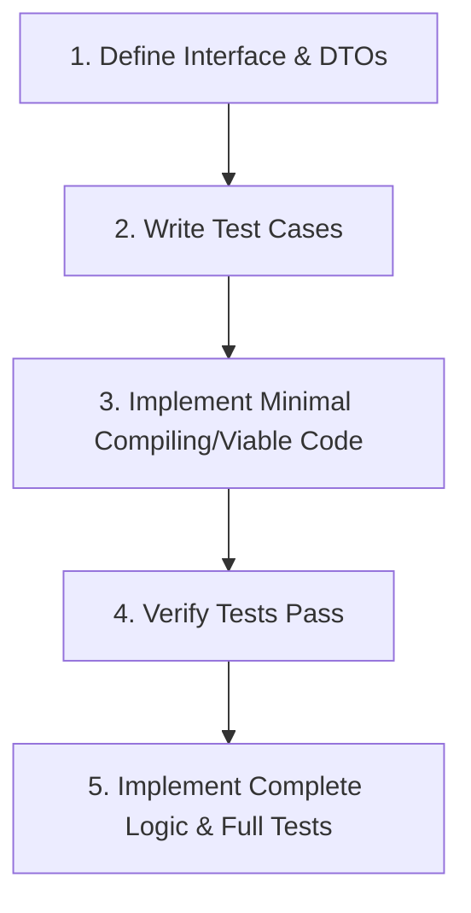

# Week 1 & 2 Implementation Plan - Foundation, PostgreSQL CRUD & ScyllaDB Time-Series with Relaxed TDD

This updated plan outlines the design and implementation details for **Week 1 (Day 1 to 5)** and **Week 2 (Day 6 to 10)** of the UDM Platform. The development process will follow a relaxed TDD-based workflow.

---

## TDD Strategy & Workflow (Relaxed)

To balance speed and process quality, we will use the following relaxed TDD workflow for business logic (Services) and API handlers:

### 1. Interface & Mocking
- Define interfaces for all repository layers (e.g., `UserRepository`, `DeviceRepository`, `TelemetryRepository`).
- Define minimal structural placeholders so the test code compiles.

### 2. Service & Handler Development
- **Step A**: Write initial tests targeting the service/handler methods.
- **Step B**: Write the minimal viable implementation (stub/minimal logic) to satisfy the compiled test.
- **Step C**: Once tests pass, expand to the complete code version and add comprehensive test assertions (e.g. edge cases, validation errors, database constraints).

---

## User Review Required

> [!IMPORTANT]
> - **Testing Scope**: Unit tests will focus on config loading, response serializations, trace ID injections, CRUD logic validations, and ScyllaDB threshold alert triggers.
> - **Local Containers**: PostgreSQL, ScyllaDB, and KeyDB must be running locally via `make compose-up` for repository integration tests.

---

## Open Questions

> [!NOTE]
> None. Local docker dependencies are ready.

---

## Proposed Changes

### Component 1: Week 1 - Configuration & Base Infrastructure

#### [MODIFY] [config.go](file:///c:/Projects/CC/Go/GoProjectTest/internal/config/config.go)
- Implement `Load()` using `joho/godotenv`.
  - TDD: Write `config_test.go` checking parsing behavior, missing environments, and default values. Implement `Load()` to satisfy.

#### [NEW] [response.go](file:///c:/Projects/CC/Go/GoProjectTest/pkg/response/response.go)
- Implement REST API response formatting.
  - TDD: Test response JSON structure. Implement `OK`, `OKWithPagination`, `BadRequest`, `NotFound`, `InternalError`, `ServiceUnavailable`.

#### [NEW] [trace.go](file:///c:/Projects/CC/Go/GoProjectTest/internal/middleware/trace.go)
- Implement request ID tracing middleware.
  - TDD: Test that incoming requests get assigned a unique `X-Request-ID` header and context value. Implement `TraceID()`.

---

### Component 2: Week 1 - PostgreSQL Schema & Migrations

- Add migration files in `migrations/`:
  - [NEW] [000001_create_users.up.sql](file:///c:/Projects/CC/Go/GoProjectTest/migrations/000001_create_users.up.sql)
  - [NEW] [000002_create_devices.up.sql](file:///c:/Projects/CC/Go/GoProjectTest/migrations/000002_create_devices.up.sql)
  - [NEW] [000003_create_alert_rules.up.sql](file:///c:/Projects/CC/Go/GoProjectTest/migrations/000003_create_alert_rules.up.sql)
  - [NEW] [000004_add_indexes.up.sql](file:///c:/Projects/CC/Go/GoProjectTest/migrations/000004_add_indexes.up.sql)

---

### Component 3: Week 1 - PostgreSQL GORM CRUD (Users, Devices, Alert Rules)

For each CRUD entity, we will define model structs, repository interfaces, write tests, and implement the services and handlers.

#### [NEW] User Module
- `internal/model/user.go` (GORM Struct)
- `internal/repository/user_repo.go` (Interface & Postgres GORM Implementation)
- `internal/service/user_service.go` (Password hashing using `bcrypt`)
- `internal/handler/user_handler.go` (REST Handlers)

#### [NEW] Device Module
- `internal/model/device.go`
- `internal/repository/device_repo.go` (Cursor-based pagination, pg_trgm fuzzy matching search on `device_code` and `name`)
- `internal/service/device_service.go`
- `internal/handler/device_handler.go`

#### [NEW] Alert Rules Module
- `internal/model/alert_rule.go`
- `internal/repository/alert_rule_repo.go`
- `internal/service/alert_rule_service.go` (validating operator: `gt/lt/gte/lte/eq`, severity: `info/warning/critical`)
- `internal/handler/alert_rule_handler.go`

---

### Component 4: Week 2 - ScyllaDB Time-Series Telemetry & Alert Events

#### [NEW] ScyllaDB Client
- [NEW] [client.go](file:///c:/Projects/CC/Go/GoProjectTest/internal/scylla/client.go)
  - Init `gocql` Session.
  - Implement `EnsureSchema()` to auto-create keyspace `device_platform`, `telemetry` (TTL 90 days), and `alert_events` (TTL 365 days) tables.

#### [NEW] Telemetry Ingestion API (Day 7)
- `internal/scylla/telemetry_repo.go`
  - Implement `BatchInsert(deviceID, points)` using CQL Batch queries (max 100 points).
- `internal/service/telemetry_service.go`
  - Write test verifying that when a telemetry metric crosses an alert rule threshold, a corresponding `alert_event` is written to ScyllaDB.
  - Implement check mechanism fetching rules from PostgreSQL, evaluating metrics, and spawning alerts.
- `internal/handler/telemetry_handler.go` (`POST /api/v1/devices/:id/telemetry`)

#### [NEW] Telemetry Query API with Multi-Day Partitioning (Day 8)
- `internal/scylla/telemetry_repo.go`
  - Implement query resolver calculating involved days (`date` partition keys) between `start` and `end`, spawning concurrent reads per partition, and merging the outputs sorted descending by `recorded_at`.
  - Handle deleted device status: Return telemetry data with `is_deleted: true` flag if the device was deleted in Postgres.
- `internal/handler/telemetry_handler.go` (`GET /api/v1/devices/:id/telemetry`, `DELETE /api/v1/devices/:id/telemetry`)

#### [NEW] Alert Events Operations & Device Detail Expansion (Day 9)
- `internal/scylla/alert_event_repo.go` (CRUD operations for alert events, Acknowledge alerts).
- `internal/handler/alert_rule_handler.go` (`GET /devices/:id/alert-events`, `PUT /alert-events/:device_id/:month/:triggered_at/:rule_id/ack`)
- Modify Device detail API: Expand `GET /api/v1/devices/:id` to fetch and embed the latest telemetry points directly from ScyllaDB.

---

### Component 5: Week 2 - Integration & Graceful Setup (Day 10)

#### [MODIFY] [routes.go](file:///c:/Projects/CC/Go/GoProjectTest/internal/routes/routes.go) & [main.go](file:///c:/Projects/CC/Go/GoProjectTest/cmd/api/main.go)
- Wire PostgreSQL GORM, ScyllaDB Client, and all REST endpoints.
- Establish Integration tests booting temporary mock router contexts to assert full flow integration.

---

## Verification & TDD execution Plan

### Automated TDD Tests
- Prior to writing code, define interfaces and construct minimal placeholder files.
- Write tests in specific package test files, implement minimal viable logic, verify tests pass, and then write the complete code.
- Run `go test -v ./...` in the specific package directory or workspace root.

### Manual Verification
- Spin up DBs: `make compose-up`.
- Confirm Postgres table models (`\dt` in psql) and ScyllaDB schemas (`DESCRIBE KEYSPACES` in cqlsh).
- Execute REST integration via HTTP requests.
