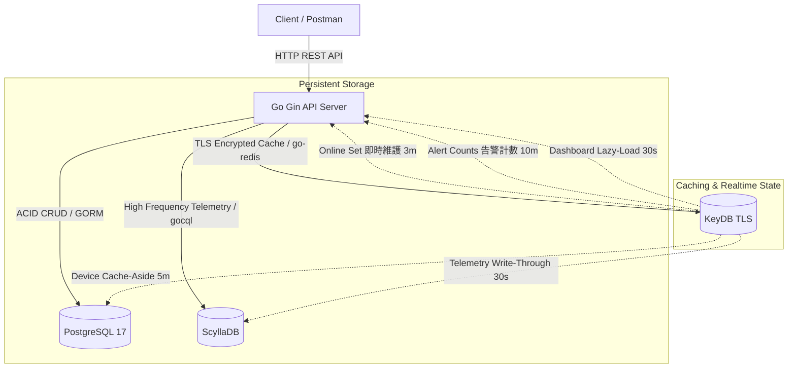

# 統一設備管理平台（Unified Device Management Platform）

本專案是一套高性能的 IoT 設備管理與遙測監控平台，結合了三種不同特性的資料庫（PostgreSQL, ScyllaDB, KeyDB），針對結構化資料、高頻時序遙測、即時快取與狀態管理進行深度優化。

## 1. 系統架構圖 (Mermaid)



> **架構說明：多維度快取策略**
>
> 在上述架構圖中，為了保護底層的 Persistent Storage 免受高併發流量衝擊，我們在 KeyDB 層引入了多維度的快取機制。
>
> #### 📌 關於 Device Cache-Aside 5m 箭頭的雙重涵義
>
> 圖中的 `Device Cache-Aside 5m` 雖然簡化為一條指向 PostgreSQL 的箭頭，但實際上它涵蓋了兩種不同維度的快取策略，針對「讀多寫少」的關聯式資料進行降壓：
>
> - **設備詳情快取 (Device Details)**：針對單一設備查詢（如 `FindByID`），系統會將設備基本資料快取 5 分鐘。由於 IoT 設備的 Metadata（名稱、MAC 地址等）極少變動，此機制能攔截 99% 的重複性單筆查詢。
> - **設備總數聚合快取 (Device Total)**：針對儀表板所需的總數統計（`dashboard:device_total`），採用獨立的 5 分鐘 TTL 快取。系統僅在 Cache Miss 時，才會向 PostgreSQL 觸發 `SELECT COUNT(*)` 查詢，避免頻繁刷新拖垮資料庫效能。
>
> #### 深入解析：儀表板 (Dashboard) 雙層快取架構
>
> 原Implementation Plan 原定規劃，Dashboard 預計由背景 Goroutine (Ticker) 定期去各資料庫撈取資料進行同步。經後來與AI來回探討評估後，考量到背景輪詢在無人訪問系統時會造成嚴重的「無效運算與 DB 負載 (Idle Overhead)」，目前的實作已全面重構為**「懶加載 (Lazy-Loading) + TTL」的雙層快取策略**。
>
> **第一層：資料源的精準分離 (Data Source Separation)**
>
> 在計算儀表板的基礎指標時，系統針對不同特性的資料，採用了完全不同的獲取策略：
>
> - 🟢 **在線總數 (Online Total) — 零 DB 負載**：完全抽離 PostgreSQL。系統依賴設備上傳遙測數據的「心跳 (Heartbeat)」，在 KeyDB 中即時維護一個 Set 結構（`dashboard:online_set`）。個別設備的在線 key 心跳窗口為 **3 分鐘**（`device:online:{id}`），Set 本身設有 **4 分鐘保護性 TTL**。當需要獲取在線數時，直接對 Set 執行 `SCard` 指令，時間複雜度為 O(1)，兼顧極致效能與即時性。
> - 🔵 **設備總數 (Device Total) — 緩存旁路**：設備總數屬於持久化資料。僅在專屬快取（`dashboard:device_total`）發生 Cache Miss 時，才去 PostgreSQL 執行聚合查詢並寫回快取。
> - 🟠 **告警計數 (Alert Counts) — 獨立事件驅動**：告警計數是一套獨立的快取機制。當遙測資料觸發告警規則時，系統會主動寫入或遞增 KeyDB 中的告警計數並設定 **10 分鐘 TTL**。Dashboard API 發生 Cache Miss 時，只是去「讀取」已存在的告警快取，藉此將高頻的告警運算與儀表板的讀取完美解耦。
>
> **第二層：API 聚合層防禦 (API Response Caching)**
>
> 當前端呼叫 Dashboard API 時，系統會優先嘗試從 KeyDB 獲取「整包儀表板結果」（`dashboard:overview`，**30 秒 TTL**）。命中快取則直接回傳 JSON；若未命中（Cache Miss），程式才會向第一層的資料源取值，完成重新組裝後，將結果寫回 30 秒 TTL 的全域快取中。
>
> **💡 架構決策總結**
>
> 透過這套重構，系統在「資料即時性」與「資源最佳化」之間取得了平衡。每 30 秒的視窗內，無論遭遇多大的併發流量，最多僅會產生 1 次底層資料庫查詢；同時，也徹底消除了無人訪問儀表板時的背景資源浪費。

---

## 2. 環境需求

- **Go**: 1.24+
- **Docker & Docker Compose**
- **Make** (Windows 建議安裝 `make` 或使用對應命令)

---

## 3. 本地快速啟動

### 3.1 準備環境變數與自簽憑證

1. **複製環境變數檔**:

   ```bash
   # Windows (PowerShell)
   copy .env.dev.example .env.dev
   # Linux / macOS
   cp .env.dev.example .env.dev
   ```

   *請打開 `.env.dev` 並設定 `POSTGRES_PASSWORD` 及其他連線屬性。*

2. **自簽憑證產生**:
   本專案 KeyDB 預設啟用了 **TLS 安全連線**。在啟動 Docker 容器前，請執行以下命令以自動產生 SSL 憑證：

   ```bash
   go run cmd/api/main.go --gen-certs # 或者直接執行 generate_certs 腳本
   # 本專案有提供 certs 自動產生，會放在 .docker/certs 目錄下
   ```

### 3.2 啟動服務

1. **啟動所有資料庫容器 (PostgreSQL + KeyDB TLS + ScyllaDB)**:

   ```bash
   make compose-up
   ```

2. **啟動 API 伺服器**:

   ```bash
   make run
   ```

3. **停止與清除**:

   ```bash
   # 停止容器
   make compose-down
   # 清空資料庫 volumes 與資料 (慎用)
   make compose-down-v
   ```

---

## 4. API 端點總覽

| 分類 | Method | Endpoint | 說明 | 快取/資料庫行為 |
| :--- | :--- | :--- | :--- | :--- |
| **健康檢查** | `GET` | `/health` | 檢查系統與三大 DB 連線狀態 | 實時連線檢測 (Degraded 模式) |
| **使用者管理** | `POST` | `/api/v1/users` | 建立使用者 | PostgreSQL |
| | `GET` | `/api/v1/users/:id` | 取得使用者資訊 (含擁有的設備數) | PostgreSQL |
| | `PUT` | `/api/v1/users/:id` | 更新使用者資訊 | PostgreSQL |
| | `DELETE`| `/api/v1/users/:id` | 軟刪除使用者 | PostgreSQL |
| **設備管理** | `POST` | `/api/v1/devices` | 建立設備 | Invalidate List Cache |
| | `GET` | `/api/v1/devices` | 設備清單 (分頁/過濾/pg_trgm 搜尋) | List Cache (2 min) |
| | `GET` | `/api/v1/devices/:id` | 取得設備詳情 | Cache-Aside (5 min) + Telemetry Cache |
| | `PUT` | `/api/v1/devices/:id` | 更新設備 | Invalidate Device & List Cache |
| | `DELETE`| `/api/v1/devices/:id` | 刪除設備 (Saga 一致性事務) | PostgreSQL Cascade + KeyDB InvalidateAll |
| **即時狀態** | `GET` | `/api/v1/devices/:id/status` | 取得設備在線狀態、最新遙測與告警計數 | KeyDB Pipeline 讀取 |
| **儀表板** | `GET` | `/api/v1/dashboard/overview` | 取得系統摘要 (總數/在線數/告警數) | KeyDB Pipeline (30s cache) |
| **快取管理** | `POST` | `/api/v1/cache/invalidate` | 管理員手動清除匹配 Key Pattern 的快取 | KeyDB Scan & Delete |
| **時序遙測** | `POST` | `/api/v1/devices/:id/telemetry` | 批量寫入遙測數據 (觸發告警) | ScyllaDB + Write-Through + Online Heartbeat |
| | `GET` | `/api/v1/devices/:id/telemetry` | 查詢時序遙測 (必須帶 start/end) | ScyllaDB 跨日分區合併查詢 |
| | `GET` | `/api/v1/devices/:id/telemetry/latest`| 查詢最新各 metric 遙測 | KeyDB Telemetry Cache (30s) / ScyllaDB |
| | `DELETE`| `/api/v1/devices/:id/telemetry` | 刪除範圍內時序數據 | ScyllaDB |
| **告警事件** | `GET` | `/api/v1/devices/:id/alert-events`| 查詢告警事件 (支援 severity 篩選) | ScyllaDB |
| | `PUT` | `/api/v1/alert-events/:device_id/:month/:triggered_at/:rule_id/ack` | 確認告警 | ScyllaDB |

---

## 5. 測試與品質

### 5.1 執行單元測試與整合測試

```bash
make test
# 或
go test ./... -v -race -cover
```

### 5.2 執行程式碼檢查 (Linter)

```bash
make lint
# 或
golangci-lint run
```

### 5.3 執行壓力測試

壓力測試腳本獨立使用 `stress` 編譯標籤，請在 **API Server 啟動且資料庫都在線** 的情況下執行：

```bash
# Windows (PowerShell)
$env:STRESS_DEVICE_COUNT="100"
$env:STRESS_CONCURRENCY="10"
$env:STRESS_DURATION_SEC="10"
go test -v ./tests/stress -tags=stress -run=TestStress
```

詳細執行步驟與壓測報告模版請見 [.docs/stress_test_report.md](file:///.docs/stress_test_report.md)。
