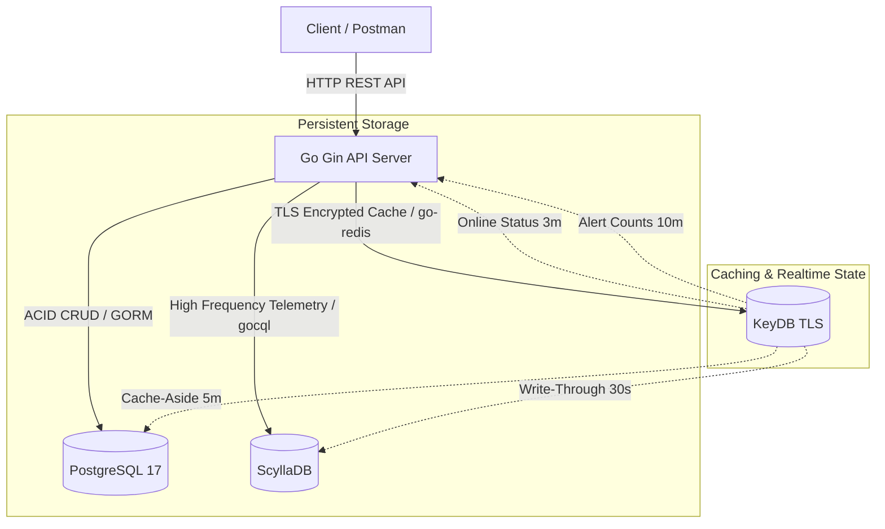

# 統一設備管理平台（Unified Device Management Platform）

本專案是一套高性能的 IoT 設備管理與遙測監控平台，結合了三種不同特性的資料庫（PostgreSQL, ScyllaDB, KeyDB），針對結構化資料、高頻時序遙測、即時快取與狀態管理進行深度優化。

## 1. 系統架構圖 (Mermaid)



> **架構設計說明 (關於儀表板快取)**:
> 依據 Implementation Plan 原定規劃，Dashboard 的「設備總數」及「在線總數」預計由背景 Goroutine (Ticker) 定期同步。經評估後，考量到系統資源與專案規模，**目前實作為「懶加載 (Lazy-Loading) + TTL」模式**：當 Dashboard API 被呼叫時，若發生 Cache Miss，才從 DB 取得並寫入 30 秒 TTL 的快取。此方式能減少無人訪問時的 DB 及 Redis 無效負載。

---

## 2. 環境需求

- **Go**: 1.24+
- **Docker & Docker Compose**
- **Make** (Windows 建議安裝 `make` 或使用對應命令)

---

## 3. 本地快速啟動

### 3.1 準備環境變數與自簽憑證

1. **複製環境變數檔**:
   ```bash
   # Windows (PowerShell)
   copy .env.dev.example .env.dev
   # Linux / macOS
   cp .env.dev.example .env.dev
   ```
   *請打開 `.env.dev` 並設定 `POSTGRES_PASSWORD` 及其他連線屬性。*

2. **自簽憑證產生**:
   本專案 KeyDB 預設啟用了 **TLS 安全連線**。在啟動 Docker 容器前，請執行以下命令以自動產生 SSL 憑證：
   ```bash
   go run cmd/api/main.go --gen-certs # 或者直接執行 generate_certs 腳本
   # 本專案有提供 certs 自動產生，會放在 .docker/certs 目錄下
   ```

### 3.2 啟動服務

1. **啟動所有資料庫容器 (PostgreSQL + KeyDB TLS + ScyllaDB)**:
   ```bash
   make compose-up
   ```

2. **啟動 API 伺服器**:
   ```bash
   make run
   ```

3. **停止與清除**:
   ```bash
   # 停止容器
   make compose-down
   # 清空資料庫 volumes 與資料 (慎用)
   make compose-down-v
   ```

---

## 4. API 端點總覽

| 分類 | Method | Endpoint | 說明 | 快取/資料庫行為 |
| :--- | :--- | :--- | :--- | :--- |
| **健康檢查** | `GET` | `/health` | 檢查系統與三大 DB 連線狀態 | 實時連線檢測 (Degraded 模式) |
| **使用者管理** | `POST` | `/api/v1/users` | 建立使用者 | PostgreSQL |
| | `GET` | `/api/v1/users/:id` | 取得使用者資訊 (含擁有的設備數) | PostgreSQL |
| | `PUT` | `/api/v1/users/:id` | 更新使用者資訊 | PostgreSQL |
| | `DELETE`| `/api/v1/users/:id` | 軟刪除使用者 | PostgreSQL |
| **設備管理** | `POST` | `/api/v1/devices` | 建立設備 | Invalidate List Cache |
| | `GET` | `/api/v1/devices` | 設備清單 (分頁/過濾/pg_trgm 搜尋) | List Cache (2 min) |
| | `GET` | `/api/v1/devices/:id` | 取得設備詳情 | Cache-Aside (5 min) + Telemetry Cache |
| | `PUT` | `/api/v1/devices/:id` | 更新設備 | Invalidate Device & List Cache |
| | `DELETE`| `/api/v1/devices/:id` | 刪除設備 (Saga 一致性事務) | PostgreSQL Cascade + KeyDB InvalidateAll |
| **即時狀態** | `GET` | `/api/v1/devices/:id/status` | 取得設備在線狀態、最新遙測與告警計數 | KeyDB Pipeline 讀取 |
| **儀表板** | `GET` | `/api/v1/dashboard/overview` | 取得系統摘要 (總數/在線數/告警數) | KeyDB Pipeline (30s cache) |
| **快取管理** | `POST` | `/api/v1/cache/invalidate` | 管理員手動清除匹配 Key Pattern 的快取 | KeyDB Scan & Delete |
| **時序遙測** | `POST` | `/api/v1/devices/:id/telemetry` | 批量寫入遙測數據 (觸發告警) | ScyllaDB + Write-Through + Online Heartbeat |
| | `GET` | `/api/v1/devices/:id/telemetry` | 查詢時序遙測 (必須帶 start/end) | ScyllaDB 跨日分區合併查詢 |
| | `GET` | `/api/v1/devices/:id/telemetry/latest`| 查詢最新各 metric 遙測 | KeyDB Telemetry Cache (30s) / ScyllaDB |
| | `DELETE`| `/api/v1/devices/:id/telemetry` | 刪除範圍內時序數據 | ScyllaDB |
| **告警事件** | `GET` | `/api/v1/devices/:id/alert-events`| 查詢告警事件 (支援 severity 篩選) | ScyllaDB |
| | `PUT` | `/api/v1/alert-events/:device_id/:month/:triggered_at/:rule_id/ack` | 確認告警 | ScyllaDB |

---

## 5. 測試與品質

### 5.1 執行單元測試與整合測試
```bash
make test
# 或
go test ./... -v -race -cover
```

### 5.2 執行程式碼檢查 (Linter)
```bash
make lint
# 或
golangci-lint run
```

### 5.3 執行壓力測試
壓力測試腳本獨立使用 `stress` 編譯標籤，請在 **API Server 啟動且資料庫都在線** 的情況下執行：
```bash
# Windows (PowerShell)
$env:STRESS_DEVICE_COUNT="100"
$env:STRESS_CONCURRENCY="10"
$env:STRESS_DURATION_SEC="10"
go test -v ./tests/stress -tags=stress -run=TestStress
```
詳細執行步驟與壓測報告模版請見 [.docs/stress_test_report.md](file:///.docs/stress_test_report.md)。
